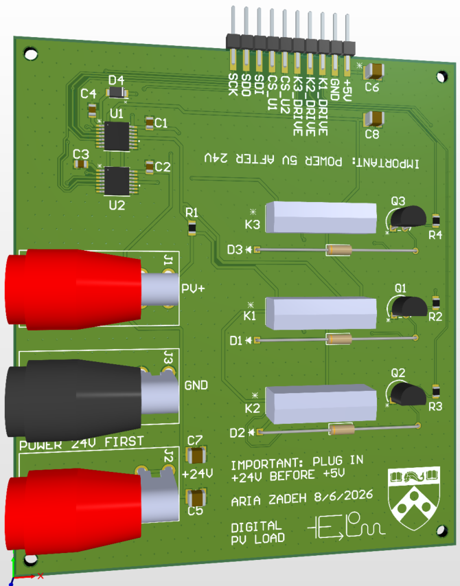
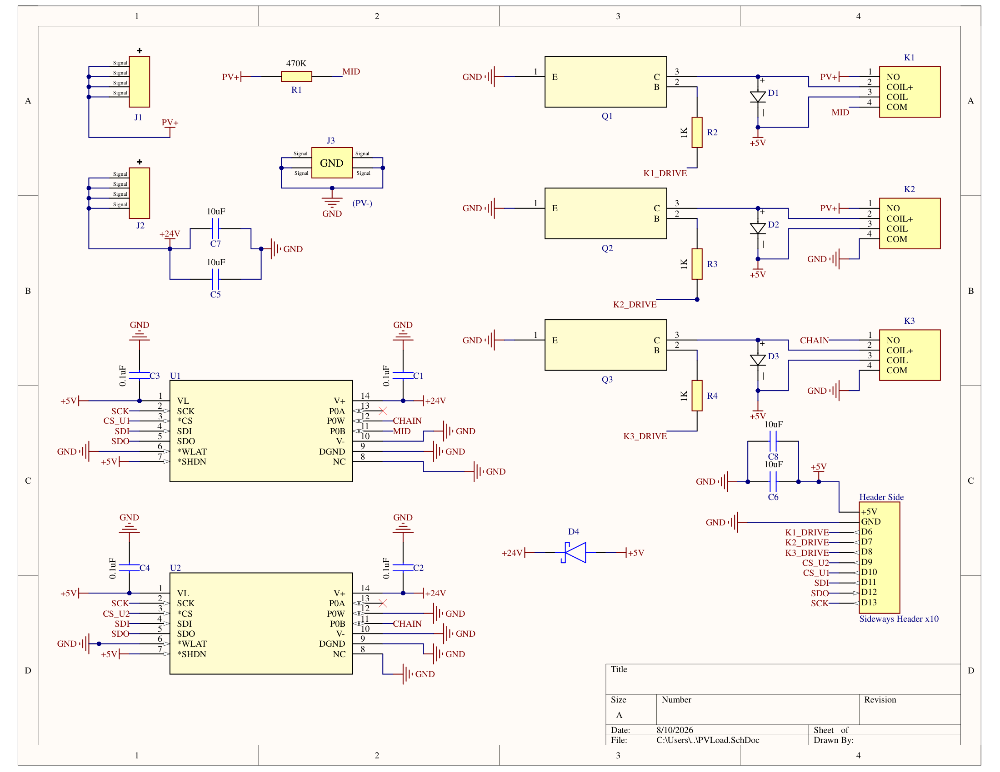

# PVLoad

Automated I-V curve measurement for photovoltaic cells. A programmable resistive load steps through
769 load states while two bench electrometers record voltage and current at each one, and a fiber
amplifier sets the illumination so the sweep can be repeated across a range of optical powers.

Hardware is a 2-layer PCB carrying two SPI digital potentiometers and three reed relays. Control is
MATLAB, over an Arduino Uno.



## Overview

A cell's operating point depends on its load, so characterizing one means sweeping the load and
recording voltage and current at each step. This board replaces a manually adjusted resistor with
two MCP41HV51 digital potentiometers in series and three reed relays, giving 769 distinct load
states from 0.150 Ω to 470 kΩ under software control.

Relays reconfigure the topology to reach the ends of the curve, which the potentiometers cannot:

| Mode | Relay action | Region |
|---|---|---|
| `SHORT` | Bypass the whole load | Short-circuit current |
| `LOW` | Bypass the second potentiometer | ~155 Ω to 5.2 kΩ |
| `FULL` | Both potentiometers in series | ~310 Ω to 10.3 kΩ |
| `OPEN` | 470 kΩ in series | Open-circuit voltage |

`LOW` and `FULL` start from one and two wiper resistances respectively. The offset is not an integer
number of steps, so the two ladders interleave and resolve finer than the 19.6 Ω step size.

Because an I-V curve is only defined at a stated illumination, a Thorlabs EDFA100P fiber amplifier
lights the cell over a USB virtual COM port. The full sweep repeats at each requested optical power.

The board contains no measurement circuitry. Voltage and current come from two Keithley 617
programmable electrometers addressed over VISA.



## Specifications

| Parameter | Value |
|---|---|
| Load range, both potentiometers | ~310 Ω to 10.3 kΩ |
| Load range, one potentiometer bypassed | ~155 Ω to 5.2 kΩ |
| Step size | ~19.6 Ω |
| Load states per sweep | 769 |
| Short-circuit path | 0.150 Ω relay contact |
| Open-circuit path | 470 kΩ |
| Cell under test | ≤9 V open circuit, ≤16 mA short circuit |
| Illumination | Thorlabs EDFA100P, 0–1000 mA pump current over USB |
| Control | SPI from an Arduino Uno, driven from MATLAB |
| Supplies | 24 V bench supply (analog), 5 V from the Arduino (logic) |
| Board | 2-layer, hand-assembled |

## Design notes

**Two potentiometers.** A single MCP41HV51-502 is 5 kΩ end to end. Two in series reach 10 kΩ and
produce the interleaved ladders described above.

**High-voltage potentiometer.** The MCP41HV51 separates its resistor-network supply from its logic
supply, so the network runs at 24 V while logic runs at 5 V. A cell reaching 9 V would clip a
part powered from the logic rail alone. This is why the board takes two supplies and why power
sequencing matters.

**Reed relays.** At 16 mA, contacts operate in dry-circuit conditions where silver-alloy power
contacts can develop surface films and read as intermittent opens. A sealed reed capsule avoids
this and holds contact resistance to 0.150 Ω, which sets the short-circuit endpoint. Coils draw
10 mA each and run from the Arduino's 5 V pin.

**Relay topology.** Every relay is wired in parallel with an element, never in series, since a
series relay could only break the loop. The open-circuit end is therefore a 470 kΩ resistor that K1
shorts out for the rest of the sweep, passing ~19 µA at 9 V.

**Coil drivers.** Each coil is switched by a 2N3904 low-side NPN through a 1 kΩ base resistor, with
a 1N4148 flyback diode across the coil. The relay has no internal diode.

**No on-board ADC.** An integrated converter would require calibration against a bench meter, so
the meters are used directly.

**Two electrometers.** Current is measured in series and voltage in parallel; one instrument cannot
do both simultaneously. Both are triggered before either reply is read, so their conversions overlap
and the readings describe the same instant.

## Repository layout

```
docs/
  HARDWARE.md      Topology, pin map, SPI protocol, BOM
  DECISIONS.md     Design rationale and open questions
  BRINGUP.md       What has been measured on the assembled board
  PVLoad_BenchCard.pdf   Printable bench reference: pinouts, power order, wiring
  benchcard.html   Source for the bench card
  img/             Schematic and PCB renders
hardware/
  altium/          Altium project, footprint and symbol libraries, STEP model
  gerbers/         Gerber X2 and NC drill files
  bom.pdf          Bill of materials
matlab/
  PVLoad_Main.m    Sweep controller, amplifier driver, meter driver
  test_arduino.m   Pin-by-pin bench test of the Arduino alone
data/
  sweep_data/      CSV output
```

[`docs/HARDWARE.md`](docs/HARDWARE.md) is the hardware reference: node-by-node topology, Arduino pin
map, SPI command format, initialization requirements, timing, and BOM with part selection reasoning.
[`docs/DECISIONS.md`](docs/DECISIONS.md) covers software design rationale and unresolved items.

## Requirements

| Component | Requires |
|---|---|
| Board | MATLAB R2019a+, MATLAB Support Package for Arduino Hardware, Arduino Uno, 24 V bench supply |
| Amplifier | Thorlabs EDFA100P, USB driver, interlock shorted |
| Meters | Two Keithley 617 electrometers, USB-GPIB adapter, Instrument Control Toolbox, vendor VISA runtime |

No firmware to compile. The support package ships its own, and SPI transactions are issued from the
host over USB.

Instrument Control Toolbox does not include a VISA implementation. Install NI-VISA or Keysight IO
Libraries separately, matching the vendor to your GPIB adapter. Without one, `visadevlist` reports
`Unable to find VISA installations`; with one and no instruments attached it reports `Unable to
find any VISA resources`.

The 617 has an IEEE-488 interface and nothing else, so it requires a USB-GPIB adapter. Match the
adapter to the installed VISA: NI-VISA drives National Instruments hardware, Keysight IO Libraries
drive Keysight hardware.

## Setup

Order matters. The cell is a supply, so it goes in last and comes out first — see
[Safety](#safety).

1. Connect the Arduino to the board through the 1x10 header.
2. Connect the bench supply to J2 (+24 V) and J3 (GND).
3. Connect the cell to J1 (PV+) and J3 (GND), with the ammeter in series on the PV+ lead, and
   keep it dark for now.
4. Connect the voltmeter across the cell terminals, upstream of the ammeter. Not across J1 and J3 —
   see [Measurement notes](#measurement-notes).
5. Power up 24 V first, then the Arduino.
6. Set `RUN` and the port and address settings in Part 1 of `matlab/PVLoad_Main.m`, and start it.
7. Illuminate the cell once the script is running and the relays are in a defined state.

Shut down in reverse: darken the cell, then the Arduino's 5 V, then 24 V.

## Usage

`RUN` selects the mode. Each opens only the hardware it needs, so subsystems can be brought up
independently.

| `RUN` | Opens | Purpose |
|---|---|---|
| `"plan"` | nothing | Validate configuration, print time estimate |
| `"board"` | Arduino | Safe state, potentiometer self-test, walk a spread of load states |
| `"ramp"` | Arduino | Climb the resistance range slowly enough to follow on a handheld meter |
| `"wiper"` | Arduino | Park at the state pairs whose difference is one wiper resistance |
| `"k3"` | Arduino | Four holds that say whether K3 closes |
| `"verify"` | Arduino | Seven holds that exercise every part of a freshly built board |
| `"edfa"` | amplifier | Identify, report temperature and status, ramp through configured levels |
| `"meters"` | electrometers | Identify, configure, take ten readings |
| `"sweep"` | all | Full experiment, written to CSV |

`"sweep"` enters the safe state, self-tests both potentiometers over SPI, warms up the amplifier,
then steps through every load state at every illumination level:

```
[lvl 2  450 mA] [  42/ 769] LOW    U1= 41  U2=  0  ~   1004.1 ohm   V=  6.21180  I=   9.8340 mA
```

Press Ctrl-C once and wait ~3 seconds to abort. The cleanup handler disables the pump and returns
the board to `OPEN`.

`SELF_TEST = false` skips potentiometer readback, allowing the control flow to run on a bare Arduino
with the board disconnected.

## Configuration

`PVLoad_Main.m` is split into two parts. Part 1 holds the settings intended to be changed. Part 2
describes the pin map, amplifier protocol, and meter command set, and changes only with the
hardware.

| Setting | Description |
|---|---|
| `RUN` | Mode, per the table above |
| `SERIAL_PORT`, `EDFA_PORT` | COM ports; enumerate with `serialportlist("available")` |
| `DMM_V_ADDRESS`, `DMM_I_ADDRESS` | VISA resource strings; enumerate with `visadevlist` |
| `EDFA_ENABLED`, `DMM_ENABLED` | Which subsystems are attached |
| `ISC_FULL`, `VOC_FULL`, `POWER_FULL` | Approximate cell behavior; sizes meter ranges and prints estimates. Only `ISC_FULL` and `VOC_FULL` past a range are errors |
| `CAL_CURRENT_MA`, `CAL_POWER_MW` | Amplifier calibration arrays |
| `LEVEL_MODE`, `LEVEL_SPACING`, `LEVEL_VALUES` | Illumination level selection |
| `EDFA_CURRENT_LIMIT` | Pump current ceiling; device maximum is 1000 mA |
| `EDFA_WARMUP` | Hold at first level, in seconds |
| `RAMP_STEPS`, `RAMP_DWELL` | States visited by `"ramp"` and how long each state is held |
| `WIPER_CODES` | Codes `"wiper"` compares at |
| `SETTLE_TIME` | Per-state hold when no meters are attached |
| `WRITE_CSV`, `OUT_DIR`, `RUN_TAG` | Output |

The 617 has no integration-time setting, so there is nothing to trade between noise and speed. A
conversion takes 365 ms or 780 ms depending on function and range, which fixes the run time. Both
meters are triggered before either reply is read, so a point costs one conversion rather than two
and a 769-state level takes about six minutes. `RUN = "plan"` prints the estimate for a given
configuration.

### Checking the load with a handheld meter

`RUN = "ramp"` needs no cell, no amplifier, and no bench meters. Bring up 24 V, then the Arduino,
clip a handheld meter across J1 and J3 in ohms, and run it. The board climbs from the `SHORT` relay
contact to the 470 kΩ `OPEN` path in `RAMP_STEPS` stages, holding each for `RAMP_DWELL` seconds so
an autoranging meter has time to settle.

The printed ohms come from the resistance model, not from the board. `R_WIPER` is a worst-case
bound rather than a measurement and `R_AB` is ±20%, so expect the meter to disagree.

`RUN = "wiper"` turns that disagreement into a number. Probe, jack and trace resistance is common
to every reading a handheld takes, so it is removed by subtracting two readings rather than by
trusting either one. Writing `s` for the ladder step, and noting that a `FULL` state at code sum
`n` puts `U1` at `n` and `U2` at zero:

```
SHORT   = K2
LOW(n)  = K1 + Rw1 + n·s + K3
FULL(n) = K1 + Rw1 + n·s + Rw2
```

`LOW(0) − SHORT` is `Rw1` and `FULL(n) − LOW(n)` is `Rw2`, each to within a 0.150 Ω reed contact.
Neither difference contains the leads, the jacks or K1. `Rw2` is a switch rather than a resistor,
so the same value should come back at every code in `WIPER_CODES`; one that tracks the code is
`R_AB` being wrong instead.

`R_WIPER` is 155 Ω per device, measured with `RUN = "verify"` on the assembled board and recorded
in [docs/BRINGUP.md](docs/BRINGUP.md). `CELL_SETTLE` is still a placeholder at zero, and it is the
settle-model term that matters most at high resistance. Measure and replace it.

### Illumination levels

| `LEVEL_MODE` | `LEVEL_VALUES` | Calibration required |
|---|---|---|
| `"current"` | Pump currents, mA | No |
| `"power"` | Optical powers, mW | Yes |
| `"table"` | Ignored; uses every calibration point | Yes |

`LEVEL_SPACING` is `"list"` for literal values, or `"linear"` or `"log"` to read `LEVEL_VALUES` as
`[min max]` and generate `LEVEL_COUNT` points. Use `"log"` when selecting by power, since Voc scales
logarithmically with illumination.

### Amplifier calibration

The EDFA100P exposes pump current, not optical power, so the relationship must be measured once and
supplied as two index-matched arrays in Part 1:

```matlab
CAL_CURRENT_MA = [ 100  150  200  250  300  400  500  600];
CAL_POWER_MW   = [0.05  0.8  4.1  9.6   18   42   72  105];
```

Couple the amplifier output into an optical power meter, step the pump current from the standby
threshold to `EDFA_CURRENT_LIMIT`, and record each pair. Ten to fifteen points is sufficient, with
higher density near the threshold knee. Both arrays must be the same length and strictly increasing.
Interpolation is linear and requested powers outside the measured range are rejected rather than
extrapolated.

Leave both empty and use `LEVEL_MODE = "current"` until measured.

## Output

`"sweep"` writes two timestamped CSVs to `data/sweep_data/`:

- `pvload_<stamp>.csv` — one row per point: `timestamp`, `level_index`, `level_current_ma`,
  `level_power_mw`, `level_valid`, `state_index`, `mode`, `u1_code`, `u2_code`, `r_nominal_ohm`,
  `voltage_v`, `current_a`, `resistance_ohm`, `power_w`, `settle_s`.
- `pvload_<stamp>_levels.csv` — one row per illumination level: pump current readback, pump
  temperature, meter range, failed reading count, and amplifier state at level end.

`resistance_ohm` and `power_w` are derived from measured voltage and current. `r_nominal_ohm` is the
model estimate used to order the sweep and is not a measurement.

Rows are appended per level, so an aborted run retains all completed levels.

## Measurement notes

Connect the voltmeter across the cell terminals, upstream of the ammeter, rather than across J1 and
J3. A voltmeter downstream of the ammeter reads low by the burden drop. The 617 is a feedback
ammeter rather than a shunt ammeter, so that drop is under 1 mV on every range but 20 mA, where it
is 3 mV. The placement no longer changes the shape of the curve, but it costs nothing to get right.

**Input impedance.** The 617 presents more than 200 TΩ in parallel with 20 pF on every volts range.
Against the 470 kΩ open-circuit path the divider error is a few parts per billion, so the `OPEN`
state is a Voc reading rather than a loaded one.

**Current range.** The 617's current ranges climb by decades to 20 mA, which is the top one, so a
~16 mA cell has exactly one range that fits. An `ISC_FULL` above 20 mA is refused at configuration
time rather than measured on a saturated range. The range is named per level and never autoranged,
because a range hunt inside a settled point spends conversions on the wrong range.

**Isc.** Three millivolts of burden and the 0.150 Ω relay contact put the `SHORT` state near 5 mV
rather than at 0 V. Voltage is measured at every point, so `SHORT` is the lowest-voltage point on
the curve rather than a point defined to be at zero. Isc is obtained by extrapolating to V = 0.

Device-dependent commands are collected in a single `DDC` struct in Part 2. The dialect is
Keithley's own rather than SCPI, so it belongs to this instrument family and does not port.

## Safety

The EDFA100P is a **Class 3B** source at 1550 nm, which is invisible.

- Output is never dark while the unit is enabled. It emits up to 30 mW of amplified spontaneous
  emission with no optical input, regardless of pump current.
- The rear interlock must be shorted for the amplifier to enable. If it opens, the unit shuts down
  and the software will not re-enable it.
- Terminate the output before running. Do not look into the fiber bulkhead.

Electrical:

- 24 V must come up before 5 V, and 5 V must come down first. D4, a Schottky from +5 V to +24 V,
  clamps the rails if the sequence is wrong, but it does not make the board usable on 5 V alone:
  V+ then sits about 0.35 V below VL, far below the 10 V the resistor network needs. There is no
  overvoltage protection, and a bench supply connected backwards gives the Arduino's 5 V rail a
  current path through D4.
- **The cell is a supply, so it belongs in the sequence too: illuminate it last, darken it first.**
  PV+ reaches U1's P0B, through R1 normally and directly through K1's contacts once K1 is energized.
  The datasheet limits those pins to `V+ + 0.3 V`, so a lit cell on an unpowered board is roughly
  8.7 V past absolute maximum. With all relays released, R1 holds that to ~19 µA against a ±20 mA
  clamp rating, which is harmless. But if 24 V drops out while 5 V is still up and K1 is closed, R1
  is shorted and the cell's full ~16 mA goes into the clamp — 80% of the absolute maximum, and the
  case that destroys a chip. D4 does not protect this path; it sits between the rails. Blocking the
  light is equivalent to unplugging and easier on the jacks. `docs/HARDWARE.md` §7 has the ratings.
- Never close the short-circuit relay during an open-circuit reading. A 0.150 Ω contact in parallel
  with 470 kΩ collapses the reading to roughly 0 V.
- Do not calculate resistance from the wiper code. The potentiometers carry ±20% tolerance and
  wiper resistance at a 24 V span is not characterized. Work from measured voltage and current.

## Testing without the board

`matlab/test_arduino.m` verifies that every pin the design uses can drive and read, using only the
Arduino, a USB cable, a multimeter, and jumper wires. It includes an SPI loopback test.

## License

MIT. See [LICENSE](LICENSE).
